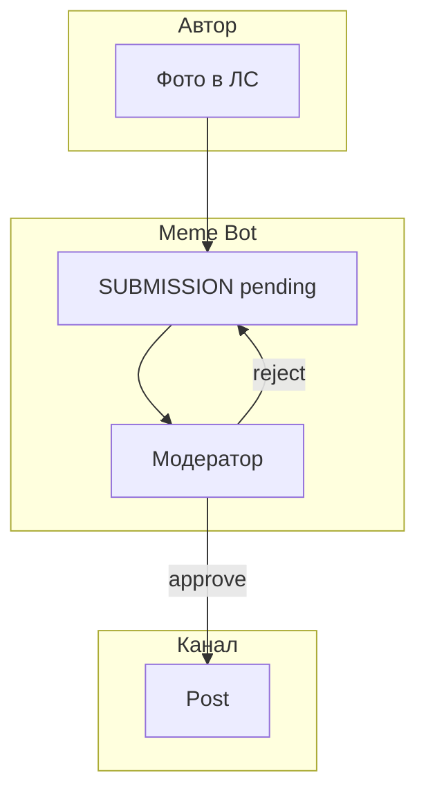
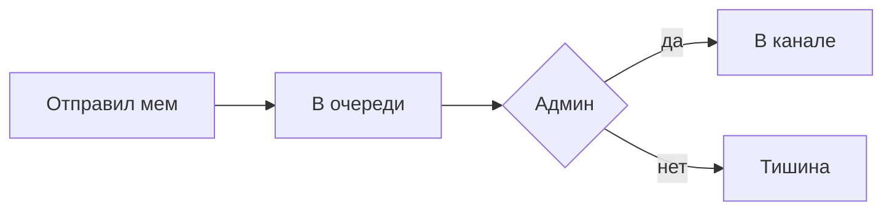
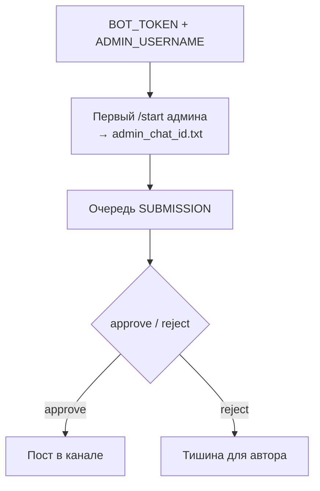

# Telegram Meme Bot

Короче: **фото в ЛС → очередь → модератор → канал**, две кнопки, без веб-админки.

Задача: принимать мемы от подписчиков, не засоряя канал спамом. Админ видит одну карточку — опубликовать или отклонить.

---

## Что сделано

- **Очередь pending** в SQLite.
- **Approve / reject** — inline у админа.
- **Пост в канал** — с атрибуцией или анонимно.
- **Антиспам** по user_id.

---

## Фишки и удобство

| Фишка | Зачем |
|-------|-------|
| `/submit` или просто фото | Низкий порог для автора |
| «Принято в очередь» | Автор не видит модерацию |
| Две кнопки админу | Быстро, без лишних экранов |
| Очередь в БД | Перезапуск бота не теряет pending |

---

## Схема данных



---

## Процесс пользователя



**Модератор / админ:**



---

## Стек

| Слой | Технология |
|------|------------|
| Бот | python-telegram-bot |
| Очередь | SQLite |
| Секреты | BOT_TOKEN, ADMIN_USERNAME |

---

## Структура репозитория

```
README.md
LICENSE
.gitignore
bot/bot.py
docs/                     — DIAGRAMS.md (3× mermaid)
examples/.env.example
requirements.txt
```

---

## Быстрый старт

```bash
export BOT_TOKEN="..."
export ADMIN_USERNAME="..."
python3 bot.py
```

Бот должен быть **админом канала** с правом post.
